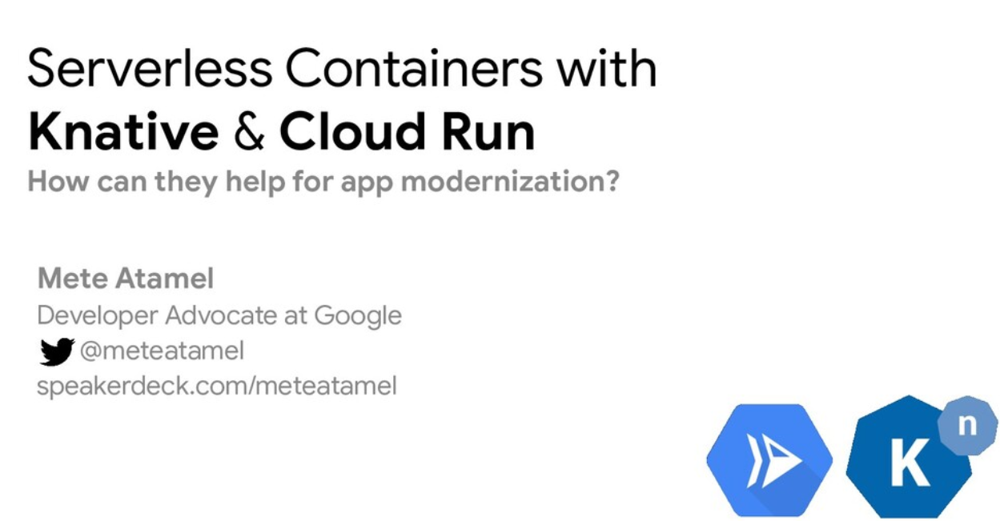

# Knative Tutorial

This tutorial shows how to use different parts of [Knative](https://www.knative.dev/docs/).

## Slides

There's a [presentation](https://speakerdeck.com/meteatamel/serverless-with-knative) that accompanies the tutorial.

[](https://speakerdeck.com/meteatamel/serverless-with-knative)

## Setup

You need to install Knative and its dependencies (eg. Istio). See [Knative Installation](https://www.knative.dev/docs/install/) page for official instructions your platform.

Alternatively, there are scripts in [setup](setup) folder to install Knative,
Istio on Google Kubernetes Engine (GKE). You can follow the instructions there.

We tested this tutorial on:

* GKE: 1.17.12-gke.500
* Istio: 1.7.1
* Knative Serving: 0.18.0
* Knative Eventing: 0.18.1
* Knative-GCP: 0.18.0
* Tekton: 0.14.2

If everything worked, all Knative components should show a `STATUS` of `Running`:

```bash
kubectl get pods -n knative-serving
kubectl get pods -n knative-eventing
kubectl get pods -n knative-monitoring
```

## Samples

Knative Serving

* [Hello World Serving](docs/helloworldserving.md)
* [Change configuration](docs/changeconfig.md)
* [Traffic splitting](docs/trafficsplitting.md)
* [Configure autoscaling](docs/configureautoscaling.md)
* [Deploy to Cloud Run](docs/deploycloudrun.md)
* [gRPC with Knative](docs/grpc.md)
* [Cluster local services](docs/clusterlocal.md)
* [Integrate with Twilio](docs/twiliointegration.md)

Knative Eventing

* [Hello World Eventing](docs/helloworldeventing.md)
* [Simple Delivery](docs/simpledelivery.md)
* [Complex Delivery](docs/complexdelivery.md)
* [Complex Delivery with reply](docs/complexdeliverywithreply.md)
* [Broker and Trigger Delivery](docs/brokertrigger.md)
* [Scheduled service](docs/scheduledeventing.md)
* [Event registry](docs/eventregistry.md)

Knative Eventing with Google Cloud

* [Cloud Pub/Sub triggered service](docs/pubsubeventing.md)
* [Cloud Storage triggered service](docs/storageeventing.md)
* [Integrate with Translation API](docs/translationeventing.md)
* [Integrate with Vision API](docs/visioneventing.md)
* [Image processing pipeline](docs/image-processing-pipeline.md)
* [BigQuery processing pipeline](docs/bigquery-processing-pipeline.md)

Build

* Tekton Pipelines
  * [Hello Tekton](docs/hellotekton.md)
  * [Hello World Build](docs/tekton-helloworldbuild.md)
  * [Docker Hub Build](docs/tekton-dockerbuild.md)
  * [Kaniko Task Build](docs/tekton-kanikotaskbuild.md)

* Knative Build (Deprecated)
  * [Hello World Build](docs/deprecated/helloworldbuild.md)
  * [Docker Hub Build](docs/deprecated/dockerbuild.md)
  * [Kaniko Build Template](docs/deprecated/kanikobuildtemplate.md)
  * [Buildpacks Build Template](docs/deprecated/buildpacksbuildtemplate.md)

-------

This is not an official Google product.
