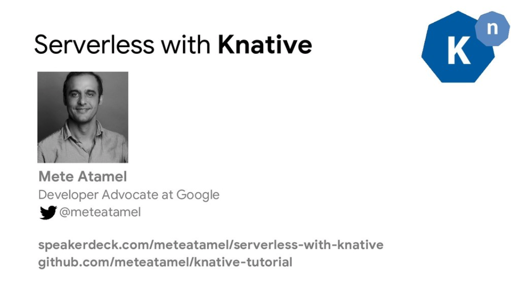

# Knative Tutorial

This tutorial shows how to use different components of [Knative](https://github.com/knative/docs): Build, Eventing, and Serving. 

## Slides

There's a [presentation](https://speakerdeck.com/meteatamel/serverless-with-knative) that accompanies the tutorial. Each section (Build, Eventing, Serving) has its own section in the slides.

[](https://speakerdeck.com/meteatamel/serverless-with-knative)

## Pre-requisites
We assume that you have a Kubernetes cluster with Knative (and its dependency Istio) installed already. If you need to install Istio and Knative, see [Knative Installation](https://github.com/knative/docs/blob/master/install/README.md) page. For Google Kubernetes Engine specific instructions, see [Knative Install on Google Kubernetes Engine](https://github.com/knative/docs/blob/master/install/Knative-with-GKE.md) page. 

We built and tested on Google Kubernetes Engine (GKE) but the samples should work on any Kubernetes cluster with Knative.   

Before going through the tutorial, make sure all Knative components show a `STATUS` of `Running`:

```
    kubectl get pods --namespace knative-serving
    kubectl get pods --namespace knative-build
    kubectl get pods --namespace knative-eventing
    kubectl get pods --namespace knative-sources
    kubectl get pods --namespace knative-monitoring
```

## Steps

* Knative Serving
   * [Hello World Serving](docs/01-helloworldserving.md)
   * [Configure domain](docs/02-configuredomain.md)
   * [Change configuration](docs/03-changeconfig.md)
   * [Traffic splitting](docs/04-trafficsplitting.md)
   * [Configure autoscaling](docs/04.5-configureautoscaling.md)
   * [Integrate with Twilio](docs/05-twiliointegration.md)
* Knative Eventing 
   * [Hello World Eventing](docs/06-helloworldeventing.md)
   * [Integrate with Translation API](docs/07-translationeventing.md)
   * [Integrate with Vision API](docs/08-visioneventing.md)
* Knative Build
   * [Hello World Build](docs/09-helloworldbuild.md)
   * [Docker Hub Build](docs/10-dockerbuild.md)
   * [Automatic Build](docs/11-autobuild.md)
-------

This is not an official Google product.
