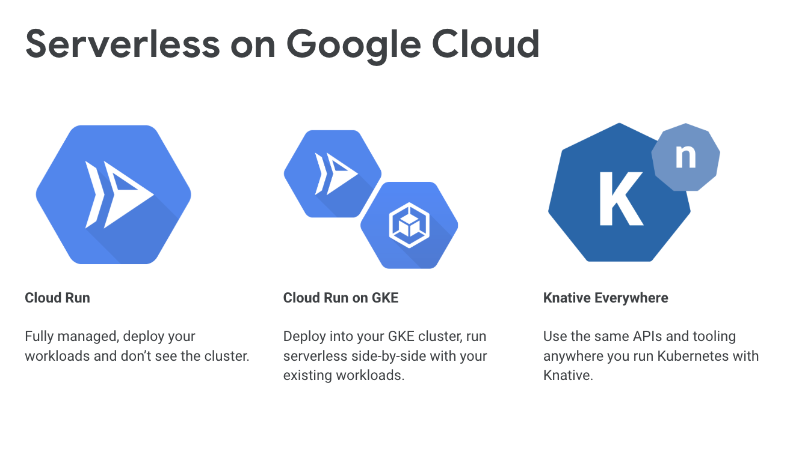
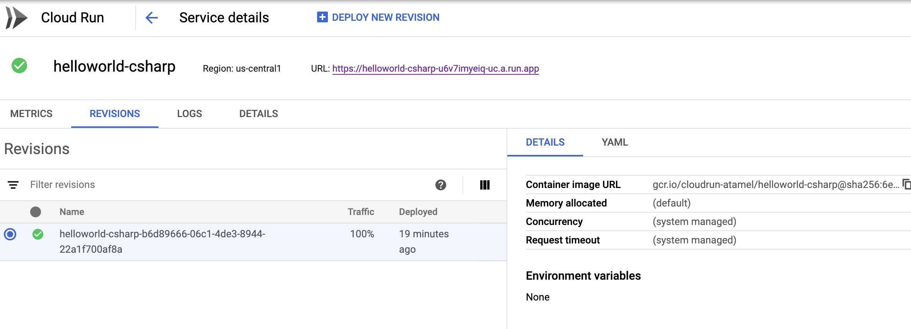

# Deploy to Cloud Run


[Cloud Run](https://cloud.google.com/run/) is part of Google Cloud and it is a managed serverless platform that enables you to run stateless containers invocable via HTTP requests.  

Cloud Run is built from Knative, letting you choose to run your containers either fully managed with Cloud Run, or in your Google Kubernetes Engine cluster with Cloud Run on GKE.



The main advantage of Cloud Run is that it's fully managed, so no infrastructure to worry about. It also comes with a simple command-line and user interface to quickly deploy and manage your serverless containers.

In this lab, we will see what it takes to deploy our [Hello World Knative serving sample](01-helloworldserving.md) from the previous lab and deploy to Cloud Run. You'll be surprised how easy it is!

## Get a project in `us-central1` region

Cloud Run currently runs only in `us-central1` region (but more regions are coming soon!). Make sure your project is pointing to the right region:

```bash
gcloud config list

[compute]
region = us-central1
zone = us-central1a
```
If not, you can set the region with `gcloud config set` command. You also want to make sure that Cloud Run API is enabled by visiting Cloud Run section in Google Cloud console. 

## Push container image to Google Container Registry

Cloud Run currently deploys images from Google Container Registry (GCR) only. In [Hello World Knative serving sample](01-helloworldserving.md), we built and pushed the container image to Docker Hub. We need to push the same image to GCR. 

In [helloworld-csharp](../serving/helloworld-csharp/) folder, run the following command. Replace `cloudrun-atamel` with your actual Google Cloud project id:

```bash
gcloud builds submit --tag gcr.io/cloudrun-atamel/helloworld-csharp:v1
```
This builds and pushes the image to GCR using Cloud Build.  

## Deploy to Cloud Run

Let's finally deploy our service to Cloud Run, it's a single gcloud command. Make sure you replace `cloudrun-atamel` with your project id:

```bash
gcloud beta run deploy --image gcr.io/cloudrun-atamel/helloworld-csharp:v1

Service name: (helloworld-csharp):
Deploying container to Cloud Run service [helloworld-csharp] in project [cloudrun-atamel] region [us-central1]
Allow unauthenticated invocations to new service [helloworld-csharp]?
(y/N)?  Y

✓ Deploying new service... Done.
  ✓ Creating Revision...
  ✓ Routing traffic...
  ✓ Setting IAM Policy...
Done.
Service [helloworld-csharp] revision [helloworld-csharp-b6d89666-06c1-4de3-8955-22a1f700af8a] has been deployed and is serving traffic at https://helloworld-csharp-u6zaimyeiq-uc.a.run.app
```
This creates a Cloud Run service and a revision for the current configuration. In the end, you get a url that you can browse to. 

You can also see the service in Cloud Run console:



## Test the service

We can test the service by visiting the url mentioned during deployment and in Cloud Run console. In this case, it's `https://helloworld-csharp-u6zaimyeiq-uc.a.run.app`.

One thing you might realize is that our service simply prints `Hello World` instead of `Hello C# Sample v1`. Let's fix that in the last step.

## Set environment variable 

If you remember, in [Hello World Knative serving sample](01-helloworldserving.md), the Knative service definition file, [service-v1.yaml](../serving/helloworld-csharp/service-v1.yaml), sets an environment variable `TARGET` and the code prints out the value of that variable: 

```yaml
env:
  - name: TARGET
  value: "C# Sample v1"
```
That's why our service printed `Hello C# Sample v1`. We need to set the same environment variable but how do we do that in Cloud Run?

In Cloud Run, you can set environment variables either through the console or command line. Let's try the command line:

```bash
gcloud beta run services update helloworld-csharp --update-env-vars TARGET='C# Sample v1'

✓ Deploying... Done.
  ✓ Creating Revision...
  ✓ Routing traffic...
Done.
```

If you visit the url of the service again, you should see `Hello C# Sample v1` instead!

## What's Next?

As you've discovered, taking a Knative service and deploying to fully Cloud Run is quite easy! Next, let's take a look at Knative Eventing. 

[Hello World Eventing](06-helloworldeventing.md)