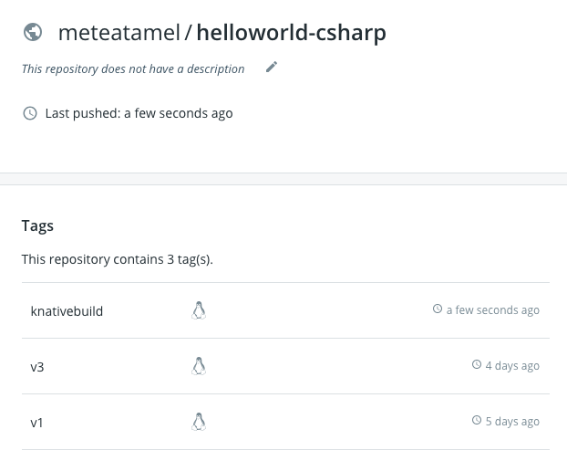

# Docker Hub Build

In the [previous lab](09-helloworldbuild.md), we built and pushed a container image to Google Cloud Registry (GCR). In this lab, we will push to Docker Hub instead. It's more involved as we need to register secrets for Docker Hub.

There's [Orchestrating a source-to-URL deployment on Kubernetes](https://github.com/knative/docs/tree/master/serving/samples/source-to-url-go) tutorial in Knative docs that explains how to do this and more but we will go through the steps here as well.

## Register secrets for Docker Hub

We need to first register a secret in Kubernetes for authentication with Docker Hub. 

Create a [docker-secret.yaml](../build/docker-secret.yaml) file for `Secret` manifest, which is used to store your Docker Hub credentials:

```yaml
apiVersion: v1
kind: Secret
metadata:
  name: basic-user-pass
  annotations:
    build.knative.dev/docker-0: https://index.docker.io/v1/
type: kubernetes.io/basic-auth
data:
  # Use 'echo -n "username" | base64' to generate this string
  username: BASE64_ENCODED_USERNAME
  # Use 'echo -n "password" | base64' to generate this string
  password: BASE64_ENCODED_PASSWORD
```

Make sure to replace `BASE64_ENCODED_USERNAME` and `BASE64_ENCODED_PASSWORD` with your Base64 encoded DockerHub username and password.

Create a [service-account.yaml](../build/service-account.yaml) for `Service Account` used to link the build process to the secret:

```yaml
apiVersion: v1
kind: ServiceAccount
metadata:
  name: build-bot
secrets:
  - name: basic-user-pass
```
Apply the `Secret` and `Service Account`:

```bash
kubectl apply -f docker-secret.yaml
secret "basic-user-pass" created
kubectl apply -f service-account.yaml
serviceaccount "build-bot" created
```

## Design the build

We will use [Kaniko](https://github.com/GoogleContainerTools/kaniko) again in our Build. Create a [build-helloworld-csharp-docker.yaml](../build/build-helloworld-csharp-docker.yaml) build file:

```yaml
apiVersion: build.knative.dev/v1alpha1
kind: Build
metadata:
  name: build-helloworld-csharp-docker
spec:
  serviceAccountName: build-bot 
  source:
    git:
      url: "https://github.com/knative/docs.git"
      revision: "v0.1.x"
    subPath: "serving/samples/helloworld-csharp/"
  steps:
  - name: build-and-push
    image: "gcr.io/kaniko-project/executor:v0.6.0"
    args:
    - "--dockerfile=/workspace/Dockerfile"
    # Replace {username} with your actual DockerHub
    - "--destination=docker.io/{username}/helloworld-csharp:knativebuild"
```
This uses Knative Build to download the source code in the 'workspace' directory and then use Kaniko to build and push an image to Docker Hub tagged with `knativebuild`. Note how we're using `build-bot` as `serviceAccountName`.

## Run and watch the build

You can start the build with:

```bash
kubectl apply -f build-helloworld-csharp-docker.yaml
```

Check that it is created:

```bash
kubectl get build
```

Soon after, you'll see a pod created for the build:

```bash
kubectl get pods
NAME                                             READY     STATUS    
build-helloworld-csharp-docker-pod-454bd8        0/1       Init:2/3
```
You can see the progress of the build with:

```bash
kubectl logs --follow --container=build-step-build-and-push build-helloworld-csharp-docker-pod-454bd8
```
When the build is finished, you'll see the pod in `Completed` state:

```bash
kubectl get pods
NAME                                              READY     STATUS 
build-helloworld-csharp-docker-pod-454bd8         0/1       Completed
```
At this point, you should see the image pushed to Docker Hub:



## What's Next?
[Automatic Build](11-autobuild.md)