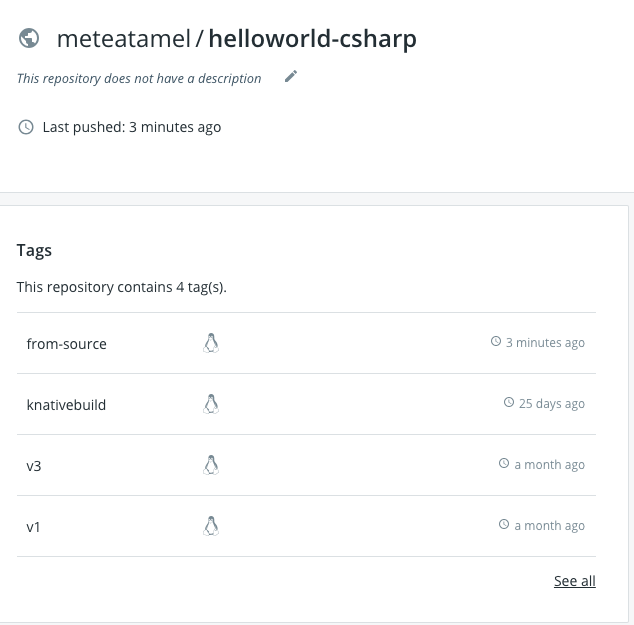

# Automatic Build

In the [previous lab](10-dockerbuild.md), we built and pushed a container image to Docker Hub manually. But it doesn't have to be manual. You can actually configure your Knative Service to automatically build when there's a change. 

There's [Orchestrating a source-to-URL deployment on Kubernetes](https://github.com/knative/docs/tree/master/serving/samples/source-to-url-go) tutorial in Knative docs that explains how to do this and more but we will go through the steps here as well.

Make sure you already registered a Secret for Docker Hub and created a ServiceAccount as explained in the previous lab. 

## Kaniko Build Template

We'll use the [Kaniko Build Template](https://github.com/knative/build-templates/tree/master/kaniko) in the service definition. 

Install Kaniko Build Template:

```yaml
kubectl apply -f https://raw.githubusercontent.com/knative/build-templates/master/kaniko/kaniko.yaml
```

Check that it is installed:

```yaml
kubectl get buildtemplate
NAME      AGE
kaniko    24m
```

## Define the service with inline Build

Let's now define a Knative Service that uses an inline Build, 

Create a [service-autobuild-docker.yaml](../build/service-autobuild-docker.yaml) file:

```yaml
apiVersion: serving.knative.dev/v1alpha1
kind: Service
metadata:
  name: helloworld-csharp-from-source
  namespace: default
spec:
  runLatest:
    configuration:
      build:
        apiVersion: build.knative.dev/v1alpha1
        kind: Build
        spec:
          serviceAccountName: build-bot
          source:
            git:
              url: https://github.com/meteatamel/knative-tutorial.git
              revision: master
            subPath: "serving/helloworld-csharp/"
          template:
            name: kaniko
            arguments:
              - name: IMAGE
                # Replace {username} with your actual DockerHub
                value: docker.io/{username}/helloworld-csharp:from-source
      revisionTemplate:
        spec:
          container:
            # Replace {username} with your actual DockerHub
            image: docker.io/{username}/helloworld-csharp:from-source
            imagePullPolicy: Always
            env:
              - name: TARGET
                value: "C# Sample from-source"
```
Note the inline `build` section where we tell Knative Build how to get the source and how to build and push the image using Kaniko. 

## Run and watch the build

You can deploy the service with:

```bash
kubectl apply -f service-autobuild-docker.yaml
```

You should see that a build is created:

```bash
kubectl get build
NAME                                  AGE
helloworld-csharp-from-source-00001   12s
```

Soon after, you'll see a pod created for the build:

```bash
kubectl get pods
NAME                                              READY     STATUS     
helloworld-csharp-from-source-00001-pod-3dfef7    0/1       Init:2/3
```
When the build is finished, you'll see the pod in `Completed` state:

```bash
kubectl get pods
NAME                                              READY     STATUS 
helloworld-csharp-from-source-00001-pod-3dfef7    0/1       Completed
```
Soon after, you should also see a new pod created for the Knative service:

```bash
NAME                                                             READY     STATUS
helloworld-csharp-from-source-00001-deployment-5b74c5c8b-w8nmw   3/3       Running
```
At this point, you should see the image pushed to Docker Hub:



## Test the service

We can finally test the service with curl and see that the new service is up and running:

```yaml
curl http://helloworld-csharp-from-source.default.$KNATIVE_INGRESS.nip.io
Hello C# Sample from-source
```

## What's Next?