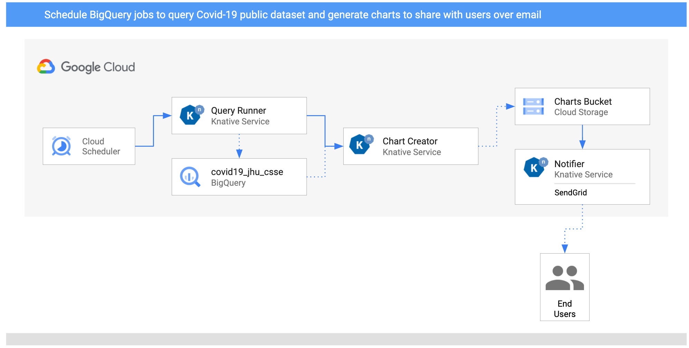

# BigQuery Processing Pipeline

In this sample, we'll build an BigQuery processing pipeline to query some public
dataset on a schedule, create charts out of the data and then notify users about
the new charts via SendGrid with Knative Eventing on GKE.



1. Two `CloudSchedulerSources` are setup to call the `QueryRunner` service once
   a day for two countries.
2. `QueryRunner` receives the scheduler event for both country, queries Covid-19
   cases for the country using BigQuery's public Covid-19 dataset and saves the
   result in a separate BigQuery table. Once done, `QueryRunner` returns a custom
   `CloudEvent` of type `dev.knative.samples.querycompleted`.
3. `ChartCreator` receives the `querycompleted` event, creates a chart from
   BigQuery data using `mathplotlib` and saves it to a Cloud Storage bucket.
4. `Notifier` receives the `com.google.cloud.storage.object.finalize` event from
   the bucket via a `CloudStorageSource` and sends an email notification to
   users using SendGrid.

## Prerequisites

We're assuming that you already went through [Cloud Storage triggered
service](./storageeventing.md) tutorial where you setup Knative with GCP &
PubSub Topic and also initialized Cloud Storage with Pub/Sub events. Here we
will start with creating buckets for the pipeline.

## Create a storage bucket

Create a unique storage bucket to save the charts and make sure the bucket and
the charts in the bucket are all public:

```bash
export BUCKET="$(gcloud config get-value core/project)-charts"
gsutil mb gs://$BUCKET
gsutil uniformbucketlevelaccess set on gs://${BUCKET}
gsutil iam ch allUsers:objectViewer gs://${BUCKET}
```

## CloudSchedulerSource

Create 2 `CloudSchedulerSources` to create Cloud Scheduler jobs to call
`QueryRunner` for 2 different countries (United Kingdom and Cyprus in this
case).

[schedulersource-uk.yaml](../eventing/processing-pipelines/bigquery/schedulersource-uk.yaml)
and
[schedulersource-cy.yaml](../eventing/processing-pipelines/bigquery/schedulersource-cy.yaml)
defines the `CloudSchedulerSources` with the schedule and country information
(under `data` field).

Create them:

```bash
kubectl apply -f schedulersource-uk.yaml -f schedulersource-cy.yaml
```

Check that they are running:

```bash
kubectl get cloudschedulersource

NAME                 READY
schedulersource-cy   True
schedulersource-uk   True
```

You should also see `CloudScheduler` jobs created:

```bash
gcloud scheduler jobs list

ID                                                  LOCATION      SCHEDULE (TZ)          TARGET_TYPE  STATE
cre-scheduler-2bcb33d8-3165-4eca-9428-feb99bc320e2  europe-west1  0 16 * * * (UTC)       Pub/Sub      ENABLED
cre-scheduler-714c0b82-c441-42f4-8f99-0e2eac9a5869  europe-west1  0 17 * * * (UTC)       Pub/Sub      ENABLED
```

## CloudStorageSource

Create a `CloudStorageSource` to connect storage events from the bucket where
the charts will be saved to the `Broker` in Knative Eventing.

[storagesource-charts.yaml](../eventing/processing-pipelines/bigquery/storagesource-charts.yaml)
defines the `CloudStorageSource`. Make sure you update the bucket name to the
actual bucket name in your project.

Create it:

```bash
kubectl apply -f storagesource-charts.yaml
```

Check that it is running:

```bash
kubectl get cloudstoragesource

NAME                         READY
storagesource-charts         True
```

## Broker

If there's no Broker in the default namespace already, label the namespace:

```bash
kubectl label ns default eventing.knative.dev/injection=enabled
```

You should see a Broker in the namespace:

```bash
kubectl get broker

NAME      READY   REASON   URL                                               AGE
default   True             http://default-broker.default.svc.cluster.local   52m
```

## Query Runner

This service receives Cloud Scheduler events for each country. It uses BigQuery API
to query for the public Covid19 dataset for those countries. Once done, it saves
the results to a new BigQuery table and passes a custom event onwards.

### Service

The code of the service is in [query-runner](../eventing/processing-pipelines/bigquery/query-runner)
folder.

Inside the top level [processing-pipelines](../eventing/processing-pipelines) folder, build
and push the container image:

```bash
export SERVICE_NAME=query-runner
docker build -t meteatamel/${SERVICE_NAME}:v1 -f bigquery/${SERVICE_NAME}/csharp/Dockerfile .
docker push meteatamel/${SERVICE_NAME}:v1
```

Create the service defined in
[kservice.yaml](../eventing/processing-pipelines/bigquery/query-runner/kservice.yaml).
Make sure you update the `PROJECT_ID` with your actual project id. This is
needed for the BigQuery client.

```bash
kubectl apply -f kservice.yaml
```

### Trigger

The trigger of the service filters on Cloud Scheduler execute events:
`com.google.cloud.scheduler.job.execute`.

Create the trigger for the service defined in
[trigger.yaml](../eventing/processing-pipelines/bigquery/query-runner/trigger.yaml):

```bash
kubectl apply -f trigger.yaml
```

## Chart Creator

This service receives the custom event from Query Runner, queries the BigQuery
table for the requested country and creates a chart out of the data using
`mathplotlib` library. Finally, the chart is uploaded to a public bucket in
Cloud Storage.

### Service

The code of the service is in [chart-creator](../eventing/processing-pipelines/bigquery/chart-creator)
folder.

Inside the [chart-creator/python](../eventing/processing-pipelines/bigquery/chart-creator/python) folder, build
and push the container image:

```bash
export SERVICE_NAME=chart-creator
docker build -t meteatamel/${SERVICE_NAME}:v1 .
docker push meteatamel/${SERVICE_NAME}:v1
```

Create the service defined in
[kservice.yaml](../eventing/processing-pipelines/bigquery/chart-creator/kservice.yaml).
Make sure you update the `BUCKET` env variable to the bucket name you created
earlier.

```bash
kubectl apply -f kservice.yaml
```

### Trigger

The trigger of the service filters on `ddev.knative.samples.querycompleted` event
types which is the custom event type emitted by the query service.

Create the trigger for the service defined in
[trigger.yaml](../eventing/processing-pipelines/bigquery/chart-creator/trigger.yaml):

```bash
kubectl apply -f trigger.yaml
```

## Notifier

This service receives the Cloud Storage events from `CloudStorageSource` and
uses SendGrid to send an email to users that a new chart has been created. You
need to setup a SendGrid account and create an API key. You can follow [this
doc](https://cloud.google.com/functions/docs/tutorials/sendgrid#preparing_the_application)
for more details on how to setup SendGrid.

### Service

The code of the service is in [notifier](../eventing/processing-pipelines/bigquery/notifier)
folder.

Inside the [notifier/python](../eventing/processing-pipelines/bigquery/notifier/python) folder, build
and push the container image:

```bash
export SERVICE_NAME=notifier
docker build -t meteatamel/${SERVICE_NAME}:v1 .
docker push meteatamel/${SERVICE_NAME}:v1
```

Create the service defined in
[kservice.yaml](../eventing/processing-pipelines/bigquery/notifier/kservice.yaml).
Make sure you update `TO_EMAILS` and `SENDGRID_API_KEY` accordingly.

```bash
kubectl apply -f kservice.yaml
```

### Trigger

The trigger of the service filters on `com.google.cloud.storage.object.finalize` event
which is the event type emitted by the Cloud Storage when a file is saved to the
bucket.

Create the trigger for the service defined in
[trigger.yaml](../eventing/processing-pipelines/bigquery/notifier/trigger.yaml):

```bash
kubectl apply -f trigger.yaml
```

## Test the pipeline

Before testing the pipeline, make sure all the triggers are ready:

```bash
kubectl get trigger

NAME                    READY   REASON   BROKER    SUBSCRIBER_URI
trigger-chart-creator   True             default   http://chart-creator.default.svc.cluster.local
trigger-notifier        True             default   http://notifier.default.svc.cluster.local
trigger-query-runner    True             default   http://query-runner.default.svc.cluster.local
```

You can wait for Cloud Scheduler to trigger the services or you can manually
trigger the jobs.

Find the jobs IDs:

```bash
gcloud scheduler jobs list

ID                                                  LOCATION      SCHEDULE (TZ)          TARGET_TYPE  STATE
cre-scheduler-2bcb33d8-3165-4eca-9428-feb99bc320e2  europe-west1  0 16 * * * (UTC)       Pub/Sub      ENABLED
cre-scheduler-714c0b82-c441-42f4-8f99-0e2eac9a5869  europe-west1  0 17 * * * (UTC)       Pub/Sub      ENABLED
```

Trigger the jobs manually:

```bash
gcloud scheduler jobs run cre-scheduler-2bcb33d8-3165-4eca-9428-feb99bc320e2
gcloud scheduler jobs run cre-scheduler-714c0b82-c441-42f4-8f99-0e2eac9a5869
```

After a minute or so, you should see 2 charts in the bucket:

```bash
gsutil ls gs://$BUCKET

gs://knative-atamel-charts/chart-cyprus.png
gs://knative-atamel-charts/chart-unitedkingdom.png
```

You should also get 2 emails with links to the charts!
