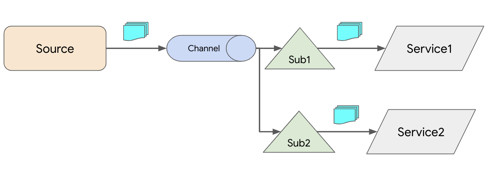

# Complex Delivery

In [Simple Delivery](simpledelivery.md) example, we saw how an Event Source can send a message directly to a Service. This works for 1-1 case but if you need fan out from an Event Source to multiple Services, then you need to use Channels and Subscriptions.



## Channel

[Channel](https://knative.dev/docs/eventing/channels/) is the persistence and forwarding layer. Knative supports a number of [Channels](https://knative.dev/docs/eventing/channels/channels-crds/) with different persistence guarantees.

For this example, we'll use InMemoryChannel which is not meant for production but ok for testing.

Create a [channel.yaml](../eventing/complex/channel.yaml):

```yaml
apiVersion: messaging.knative.dev/v1alpha1
kind: InMemoryChannel
metadata:
  name: channel
```

Create the InMemoryChannel:

```bash
kubectl apply -f channel.yaml

inmemorychannel.messaging.knative.dev/channel created
```

## Source

Knative supports a number of [Event Sources](https://knative.dev/docs/eventing/sources) to read all sorts of events into Knative.

For this example, let's use CronJobSource, an in-memory Event Source that fires events based on given cron schedule:

Create a [source.yaml](../eventing/complex/source.yaml):

```yaml
apiVersion: sources.eventing.knative.dev/v1alpha1
kind: CronJobSource
metadata:
  name: source
spec:
  schedule: "* * * * *"
  data: '{"message": "Hello world from cron!"}'
  sink:
    apiVersion: messaging.knative.dev/v1alpha1
    kind: InMemoryChannel
    name: channel
```

It sends a message every minute to an event sink, which is an InmMemoryChannel in this case.

Create the source:

```bash
kubectl apply -f source.yaml

cronjobsource.sources.eventing.knative.dev/source created
```

## Service

Next, let's create the Kubernetes or Knative services that CronJobSource will target.

Create a [service1.yaml](../eventing/complex/service1.yaml):

```yaml
apiVersion: serving.knative.dev/v1
kind: Service
metadata:
  name: service1
spec:
  template:
    spec:
      containers:
        - image: docker.io/meteatamel/event-display:v1
```

Create another [service2.yaml](../eventing/complex/service2.yaml) for the second service.

These are Knative Services that simply log out received messages.

Create the services:

```bash
kubectl apply -f service1.yaml -f service2.yaml

service.serving.knative.dev/service1 created
service.serving.knative.dev/service2 created
```

## Subscription

Finally, connect services to the channel with subscriptions.

Create a [subscription1.yaml](../eventing/complex/subscription1.yaml) file:

```yaml
apiVersion: messaging.knative.dev/v1alpha1
kind: Subscription
metadata:
  name: subscription1
spec:
  channel:
    apiVersion: messaging.knative.dev/v1alpha1
    kind: InMemoryChannel
    name: channel
  subscriber:
    ref:
      apiVersion: serving.knative.dev/v1
      kind: Service
      name: service1
```

Create another [subscription2.yaml](../eventing/complex/subscription2.yaml) for the second subscription.

Create the subscriptions:

```bash
kubectl apply -f subscription1.yaml -f subscription2.yaml

subscription.messaging.knative.dev/subscription1 created
subscription.messaging.knative.dev/subscription2 created
```

## Verify

Check the running pods:

```bash
kubectl get pods

NAME                                                              READY STATUS    RESTARTS   AGE
cronjobsource-source-3c465b71-4bbe-4611-a816-a73a75cf8681-66ps5   1/1     Running   0          2m54s
service1-x25xg-deployment-55f957448-rtljx                         2/2     Running   0          2m57s
service2-5tpzm-deployment-58c6bcb455-vxdg                         2/2     Running   0          2m57s
```

Check the logs of the services. You should see messages from the CronJobSource in each service:

```bash
kubectl logs service-x25xg-deployment-55f957448-rtljx -c user-container

info: event_display.Startup[0]
      Event Display received event: {"message":"Hello world from cron!"}
```
