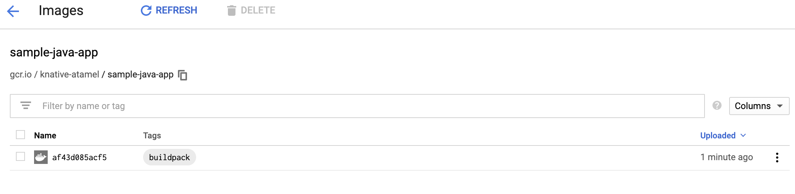

```
As of Knative 0.8, Knative Build has been deprecated in favor of Tekton Pipelines. This doc is kept as a reference for pre-0.8 Knative installations. Please refer to Tekton Pipelines section of the tutorial on how to do builds in Knative going forward.
```

# Buildpacks Build Template

Knative comes with a number of ready-to-use [build-templates](https://github.com/knative/build-templates) and one of my favorites is the [template](https://github.com/knative/build-templates/tree/master/buildpacks) for Cloud Native Buildpacks.

[Cloud Native Buildpacks](https://buildpacks.io/) allow you to go from source code to a container image without having to define a `Dockerfile`. Buildpacks does this with auto-detection magic to figure out what language your code is written in and what kind of dependencies it has. In this end, you end up with a runnable app image.

So far, all of the build labs required a `Dockerfile` in order to build and push an image. In this lab, let's use [buildpacks template](https://github.com/knative/build-templates/tree/master/buildpacks) to create and push an image without a `Dockerfile`.

## Install Buildpacks BuildTemplate

First, we need to install Buildpacks Build Template:

```bash
kubectl apply -f https://raw.githubusercontent.com/knative/build-templates/master/buildpacks/cnb.yaml
```

Check that it is installed:

```bash
kubectl get buildtemplate

NAME             AGE
buildpacks-cnb   1m
```

## Design the build

Let's create a Build now to build a sample Java app on GitHub ([sample-java-app](https://github.com/buildpack/sample-java-app.git)).

Create a [buildtemplate-buildpack-sample-java-app-gcr.yaml](../build/deprecated/buildtemplate-buildpack-sample-java-app-gcr.yaml) build file:

```yaml
apiVersion: build.knative.dev/v1alpha1
kind: Build
metadata:
  name: buildtemplate-buildpack-sample-java-app-gcr
spec:
  source:
    git:
      url: https://github.com/buildpack/sample-java-app.git
      revision: master
  template:
      name: buildpacks-cnb
      arguments:
      - name: IMAGE
        # Replace {PROJECT_ID} with your GCP Project's ID.
        value: gcr.io/{PROJECT_ID}/sample-java-app:buildpack
```

One thing you'll notice is that the `sample-java-app` does not define a Dockerfile. Buildpacks will use its auto-detection to build the image and push it to the location specified in `IMAGE` argument.

## Run and watch the build

Start the build:

```bash
kubectl apply -f buildtemplate-buildpack-sample-java-app-gcr.yaml
```

After a few minutes, check the build is succeeded:

```bash
kubectl get build

NAME                                          SUCCEEDED
buildtemplate-buildpack-sample-java-app-gcr    True
```

At this point, you should see the image pushed to GCR:



## What's Next?
