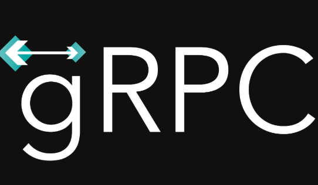

# Serverless gRPC with Knative



[gRPC](https://grpc.io/) is a high performance, language agnostic, open-source RPC framework. It has many benefits such as efficient Protobuf binary serialization, client/server/bi-directional streaming options, common service definitions with Protobuf with language agnostic implementations, and more.

In this lab, we will deploy a 'serverless' gRPC service with Knative.

## Create a gRPC server & client

Follow the instructions for your preferred language to create a simple gRPC server and client:

* [Create gRPC server & client - C#](grpc-csharp.md)

* [Create gRPC server & client - Python](grpc-python.md)

## Build and push Docker image

Build and push the Docker image (replace `{username}` with your actual DockerHub):

```bash
docker build -t {username}/grpc-greeter:v1 .

docker push {username}/grpc-greeter:v1
```

## Deploy the Knative service

Create a [service.yaml](../serving/grpc/service.yaml) file.

```yaml
apiVersion: serving.knative.dev/v1alpha1
kind: Service
metadata:
  name: grpc-greeter
  namespace: default
spec:
  template:
    spec:
      containers:
        # Replace {username} with your actual DockerHub
        - image: docker.io/{username}/grpc-greeter:v1
          ports:
          - name: h2c
            containerPort: 8080
```

Notice how we need to define a port with `h2c` (HTTP/2) for gRPC to work. More info on this in [runtime-contract](https://github.com/knative/serving/blob/master/docs/runtime-contract.md#protocols-and-ports).

Deploy the service:

```bash
kubectl apply -f service.yaml
```

Check that the service is created and pods of the service are running:

```bash
kubectl get ksvc grpc-greeter

NAME
grpc-greeter

kubectl get pods

NAME
grpc-greeter-5tpwl-deployment-6fb423289c5-r5qmt
```

## Test the service

To test your service, go to the greeter client and change the url from localhost to the Knative service url.

* C#

  Inside [GrpcGreeterClient](../serving/grpc/csharp/GrpcGreeterClient), change [Program.cs](../serving/grpc/csharp/GrpcGreeterClient/Program.cs):

  ```csharp
  //httpClient.BaseAddress = new Uri("http://localhost:50051");
  httpClient.BaseAddress = new Uri("http://grpc-greeter.default.34.77.201.183.nip.io");
  ```

  Run the app:

  ```bash
  dotnet run

  Greeting: Hello GreeterClient
  Press any key to exit...
  ```

* Python

  Get the address of your gRPC server:

  ```bash
  GRPC_SERVER="$(kubectl get ksvc grpc-greeter -o jsonpath='{.status.url}')"
  ```

  Run the app:

  ```bash
  python greet_client.py -s $GRPC_SERVER -p 80

  Greeting: Hello GreeterClient
  ```

Voilà! The gRPC client is now talking to a serverless gRPC service on Knative.
