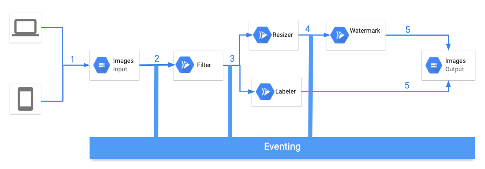

# Image Processing Pipeline

In this sample, we'll build an image processing pipeline to connect Google Cloud
Storage events to various services with Knative Eventing on GKE.



1. An image is saved to an input Cloud Storage bucket.
2. Cloud Storage update event is read into Knative by `CloudStorageSource`.
3. Filter service receives the Cloud Storage event. It uses Vision API to
   determine if the image is safe. If so, it creates a custom `CloudEvent` of
   type `dev.knative.samples.fileuploaded` and passes it onwards.
4. Resizer service receives the `fileuploaded` event, resizes the image using
   [ImageSharp](https://github.com/SixLabors/ImageSharp) library, saves to the
   resized image to the output bucket, creates a custom `CloudEvent` of type
   `dev.knative.samples.fileresized` and passes the event onwards.
5. Watermark service receives the `fileresized` event, adds a watermark to the
   image using [ImageSharp](https://github.com/SixLabors/ImageSharp) library and
   saves the image to the output bucket.
6. Labeler receives the `fileuploaded` event, extracts labels of the image with
   Vision API and saves the labels to the output bucket.

## Prerequisites

We're assuming that you already went through [Cloud Storage triggered
service](./storageeventing.md) tutorial where you setup Knative with GCP &
PubSub Topic and also initialized Cloud Storage with Pub/Sub events. Here we
will start with creating buckets for the pipeline.

## Create storage buckets

Create 2 unique storage buckets to save pre and post processed images:

```bash
export BUCKET1="$(gcloud config get-value core/project)-images-input"
export BUCKET2="$(gcloud config get-value core/project)-images-output"
gsutil mb gs://${BUCKET1}
gsutil mb gs://${BUCKET2}
```

## CloudStorageSource

Create a `CloudStorageSource` to connect storage events from the first bucket to
the `Broker` in Knative Eventing.

[cloudstoragesource.yaml](../eventing/image-processing-pipeline/cloudstoragesource.yaml)
defines the `CloudStorageSource`. Make sure you update the bucket name to the
actual bucket name in your project.

Create the CloudStorageSource:

```bash
kubectl apply -f cloudstoragesource.yaml
```

You should see the `CloudStorageSource` running:

```bash
kubectl get cloudstoragesource

NAME                         READY   REASON   AGE
storagesource-images-input   True             23s
```

## Broker

If there's no Broker in the default namespace already, label the namespace:

```bash
kubectl label namespace default knative-eventing-injection=enabled
```

You should see a Broker in the namespace:

```bash
kubectl get broker

NAME      READY   REASON   URL                                               AGE
default   True             http://default-broker.default.svc.cluster.local   52m
```

## Enable Vision API

Some services use Vision API. Make sure the Vision API is enabled:

```bash
gcloud services enable vision.googleapis.com
```

## Filter

This service receives Cloud Storage events for saved images. It uses Vision API
to determine if the image is safe. If so, it passes a custom event onwards.

### Service

The code of the service is in [filter](../eventing/image-processing-pipeline/filter)
folder.

Inside the top level
[image-processing-pipeline](../eventing/image-processing-pipeline) folder, build
and push the container image:

```bash
export SERVICE_NAME=filter
docker build -t meteatamel/${SERVICE_NAME}:v1 -f ${SERVICE_NAME}/csharp/Dockerfile .
docker push meteatamel/${SERVICE_NAME}:v1
```

Create the service defined in
[kservice.yaml](../eventing/image-processing-pipeline/filter/kservice.yaml):

```bash
kubectl apply -f kservice.yaml
```

### Trigger

The trigger of the service filters on Cloud Storage finalize events:
`com.google.cloud.storage.object.finalize`.

Create the trigger for the service defined in
[trigger.yaml](../eventing/image-processing-pipeline/filter/trigger.yaml):

```bash
kubectl apply -f trigger.yaml
```

## Resizer

This service receives the custom event, resizes the image using
[ImageSharp](https://github.com/SixLabors/ImageSharp) library and passes the
event onwards.

### Service

The code of the service is in [resizer](../eventing/image-processing-pipeline/resizer)
folder.

Inside the top level
[image-processing-pipeline](../eventing/image-processing-pipeline) folder, build
and push the container image:

```bash
export SERVICE_NAME=resizer
docker build -t meteatamel/${SERVICE_NAME}:v1 -f ${SERVICE_NAME}/csharp/Dockerfile .
docker push meteatamel/${SERVICE_NAME}:v1
```

Create the service defined in
[kservice.yaml](../eventing/image-processing-pipeline/resizer/kservice.yaml).
Make sure you update the `BUCKET` env variable to the value of `$BUCKET2`:

```bash
kubectl apply -f kservice.yaml
```

### Trigger

The trigger of the service filters on `dev.knative.samples.fileuploaded` event
types which is the custom event type emitted by the filter service.

Create the trigger for the service defined in
[trigger.yaml](../eventing/image-processing-pipeline/resizer/trigger.yaml):

```bash
kubectl apply -f trigger.yaml
```

## Watermark

This service receives the event, adds the watermark to the image using
[ImageSharp](https://github.com/SixLabors/ImageSharp) library and saves the
image to the output bucket.

### Service

The code of the service is in [watermarker](../eventing/image-processing-pipeline/watermarker)
folder.

Inside the top level
[image-processing-pipeline](../eventing/image-processing-pipeline) folder, build
and push the container image:

```bash
export SERVICE_NAME=watermarker
docker build -t meteatamel/${SERVICE_NAME}:v1 -f ${SERVICE_NAME}/csharp/Dockerfile .
docker push meteatamel/${SERVICE_NAME}:v1
```

Create the service defined in
[kservice.yaml](../eventing/image-processing-pipeline/watermarker/kservice.yaml).
Make sure you update the `BUCKET` env variable to the value of `$BUCKET2`:

```bash
kubectl apply -f kservice.yaml
```

### Trigger

The trigger of the service filters on `dev.knative.samples.fileresized` event
types which is the custom event type emitted by the resizer service.

Create the trigger for the service defined in
[trigger.yaml](../eventing/image-processing-pipeline/watermarker/trigger.yaml):

```bash
kubectl apply -f trigger.yaml
```

## Labeler

Labeler receives the event, extracts labels of the image with Vision API and
saves the labels to the output bucket.

### Service

The code of the service is in [labeler](../eventing/image-processing-pipeline/labeler)
folder.

Inside the top level
[image-processing-pipeline](../eventing/image-processing-pipeline) folder, build
and push the container image:

```bash
export SERVICE_NAME=labeler
docker build -t meteatamel/${SERVICE_NAME}:v1 -f ${SERVICE_NAME}/csharp/Dockerfile .
docker push meteatamel/${SERVICE_NAME}:v1
```

Create the service defined in
[kservice.yaml](../eventing/image-processing-pipeline/labeler/kservice.yaml).
Make sure you update the `BUCKET` env variable to the value of `$BUCKET2`:

```bash
kubectl apply -f kservice.yaml
```

### Trigger

The trigger of the service filters on `dev.knative.samples.fileuploaded` event
types which is the custom event type emitted by the filter service.

Create the trigger for the service defined in
[trigger.yaml](../eventing/image-processing-pipeline/labeler/trigger.yaml):

```bash
kubectl apply -f trigger.yaml
```

## Test the pipeline

Before testing the pipeline, make sure all the triggers are ready:

```bash
kubectl get trigger

NAME                  READY   REASON   BROKER    SUBSCRIBER_URI                                 AGE
trigger-filter        True             default   http://filter.default.svc.cluster.local        3d19h
trigger-labeler       True             default   http://labeler.default.svc.cluster.local       3d
trigger-resizer       True             default   http://resizer.default.svc.cluster.local       3d19h
trigger-watermarker   True             default   http://watermarker.default.svc.cluster.local   3d
```

You can upload an image to the input storage bucket:

```bash
gsutil cp  ../pictures/beach.jpg gs://${BUCKET1}
```

After a minute or so, you should see resized, watermarked and labelled image in
the output bucket:

```bash
gsutil ls gs://${BUCKET2}

gs://knative-atamel-images-output/beach-400x400-watermark.jpeg
gs://knative-atamel-images-output/beach-400x400.png
gs://knative-atamel-images-output/beach-labels.txt
```
