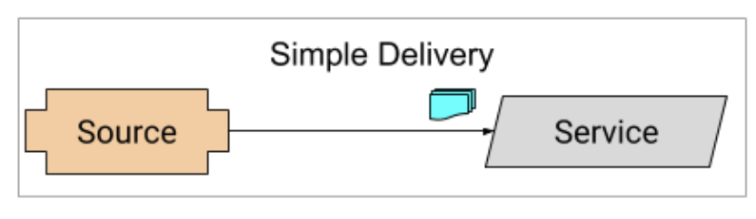

# Simple Delivery

In Knative Eventing, you typically use Broker and Trigger to receive and filter messages. However, there are other simpler and more complex delivery models.

Let's take a look at the simple delivery scenario where an Event Source sends messages directly to a Service:



## Source

Knative supports a number of [Event Sources](https://knative.dev/docs/eventing/sources) to read all sorts of events in Knative.

For this example, let's use CronJobSource, an in-memory Event Source that fires events based on given cron schedule:

Create a [source.yaml](../eventing/simple/source.yaml) file:

```yaml
apiVersion: sources.eventing.knative.dev/v1alpha1
kind: CronJobSource
metadata:
  name: source
spec:
  schedule: "* * * * *"
  data: '{"message": "Hello world from cron!"}'
  sink:
    apiVersion: serving.knative.dev/v1
    kind: Service
    name: service
```

It sends a message every minute to an event sink, which is a Knative Service in this case.

Create the source:

```bash
kubectl apply -f source.yaml

cronjobsource.sources.eventing.knative.dev/source created
```

## Service

Next, let's create the Kubernetes or Knative service that CronJobSource is targeting.

Create a [service.yaml](../eventing/simple/service.yaml) file:

```yaml
apiVersion: serving.knative.dev/v1
kind: Service
metadata:
  name: service
spec:
  template:
    spec:
      containers:
        - image: docker.io/meteatamel/event-display:v1
```

This is a Knative Service that simply logs out received messages.

Create the service:

```bash
kubectl apply -f service.yaml

service.serving.knative.dev/service created
```

## Verify

Check the running pods:

```bash
kubectl get pods

NAME                                                              READY STATUS    RESTARTS   AGE
cronjobsource-source-3c465b71-4bbe-4611-a816-a73a75cf8681-66ps5   1/1     Running   0          2m54s
service-x25xg-deployment-55f957448-rtljx                          2/2     Running   0          2m57s
```

Check the logs of the service. You should see messages from the CronJobSource:

```bash
kubectl logs service-x25xg-deployment-55f957448-rtljx -c user-container

info: event_display.Startup[0]
      Event Display received event: {"message":"Hello world from cron!"}
```
