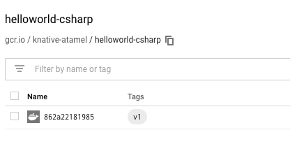

# Google Container Registry Build

In this step, let's utilize Tekton Pipelines to build containers and push to Google Container Registry (GCR).

## Design the Task

[Kaniko](https://github.com/GoogleContainerTools/kaniko) is a tool to build container images from a Dockerfile, inside a container in Kubernetes cluster. The advantage is that Kaniko doesn't depend on a Docker daemon. Let's create a generic Task to use Kaniko.

Take a look at [task-build-docker-images-from-git-source.yaml](../build/task-build-docker-images-from-git-source.yaml) file.

This defines a generic Task to use Kaniko to build and push the image.

Create the task:

```bash
kubectl apply -f task-build-docker-images-from-git-source.yaml

task.tekton.dev/build-docker-image-from-git-source created
```

## Design the TaskRun

Next, let's define a TaskRun to run the Task. 

Take a look at [taskrun-build-helloworld-gcr.yaml](../build/taskrun-build-helloworld-gcr.yaml) file.
This TaskRun defines the source code to build, the location of the image to push to and it refers to the
Task we defined previously.

## Run and watch the TaskRun

You can start the TaskRun with:

```bash
kubectl apply -f taskrun-build-helloworld-gcr.yaml

pipelineresource.tekton.dev/git-knative-tutorial unchanged
pipelineresource.tekton.dev/image-docker-knative-tutorial created
taskrun.tekton.dev/build-helloworld-docker created
```

Check that all the Tekton artifacts are created:

```bash
kubectl get tekton-pipelines

NAME                                                        AGE
pipelineresource.tekton.dev/git-knative-tutorial            12m
pipelineresource.tekton.dev/image-docker-knative-tutorial   22s
pipelineresource.tekton.dev/image-gcr-knative-tutorial      12m

NAME                                         SUCCEEDED   REASON      STARTTIME   COMPLETIONTIME
taskrun.tekton.dev/build-helloworld-gcr      True        Succeeded   12m         10m

NAME                                                 AGE
task.tekton.dev/build-docker-image-from-git-source   13m
```

Soon after, you'll see a pod created for the build:

```bash
kubectl get pods

NAME                                              READY   STATUS    RESTARTS   AGE
build-helloworld-docker-pod-a1d405                2/4     Running   0          61s
```

You can see the progress of the build with:

```bash
kubectl logs --follow --container=step-build-and-push <podid>
```

When the build is finished, you'll see the pod in `Completed` state:

```bash
kubectl get pods

NAME                                      READY     STATUS
build-helloworld-gcr-pod-3ed981            0/4       Completed
```

At this point, you should see the image pushed to GCR:


