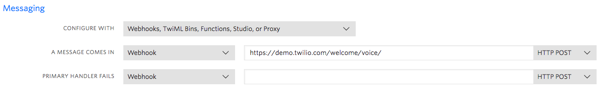
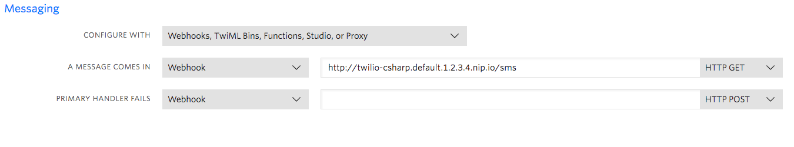

# Integrate with Twilio

You can use [Twilio](https://www.twilio.com/) to embed voice, VoIP, and messaging into applications. In this lab, we will use a [Webhook](https://www.twilio.com/docs/glossary/what-is-a-webhook) to reply to SMS messages sent to a Twilio phone number. The Webhook is going to be a Knative service running on GKE.

## Twilio Setup

You need to [create a Twilio account](https://www.twilio.com/try-twilio) and get a [Twilio phone number](https://www.twilio.com/docs/usage/tutorials/how-to-use-your-free-trial-account#get-your-first-twilio-phone-number). You need to make sure that the Twilio number is SMS enabled.

In Twilio [console](https://www.twilio.com/console), click on the phone number and go to `Messaging` section. There's a Webhook defined for when a message comes in. We will change that to our Knative Service later:



## Create Twilio SMS handler

Follow the instructions for your preferred language to create a service to handle SMS messages to our Twilio number:

* [Create Twilio SMS Handler - C#](twiliointegration-csharp.md)

* [Create Twilio SMS Handler - Python](twiliointegration-python.md)

## Build and push Docker image

Build and push the Docker image (replace `{username}` with your actual DockerHub):

```bash
docker build -t {username}/twilio:v1 .

docker push {username}/twilio:v1
```

## Deploy the Knative service

Take a look at the [service.yaml](../serving/twilio/service.yaml) file.

After the container is pushed, deploy the app.

```bash
kubectl apply -f service.yaml
```

Check that the service is created:

```bash
kubectl get ksvc twilio

NAME     URL                                    LATESTCREATED   LATESTREADY    READY   REASON
twilio   http://twilio.default.1.2.3.4.xip.io   twilio-v96ms    twilio-v96ms   True
```

## Test the service

Let's first check that our service works as expected:

```bash
export TWILIO_URL=$(kubectl get route twilio -o jsonpath="{.status.url}")
echo $TWILIO_URL
http://twilio.default.1.2.3.4.xip.io

curl $TWILIO_URL/sms?Body=Hello+World!
<?xml version="1.0" encoding="UTF-8"?><Response><Message>The Knative copy cat says: Hello World!</Message></Response>
```

We can finally test our service by sending an SMS to our Twilio number. We need to setup Twilio Webhook first.

In Twilio [console](https://www.twilio.com/console), click on the phone number and go to `Messaging` section. For Webhook defined for when a message comes in, change it to your Knative service name and XIP.IO domain:



Now, you can send an SMS message to your Twilio number and you should get a reply back from the Knative service!
